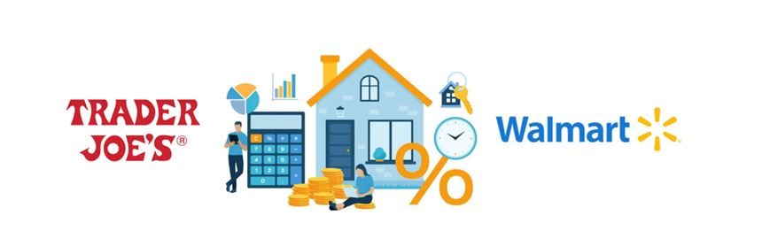
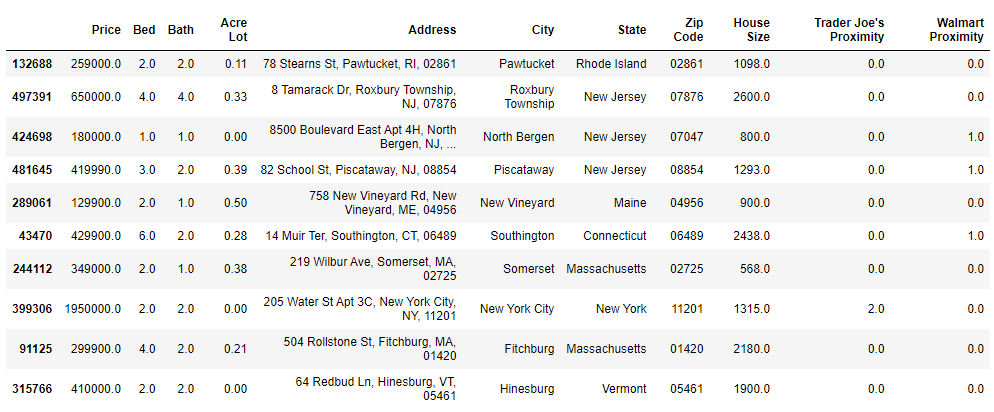
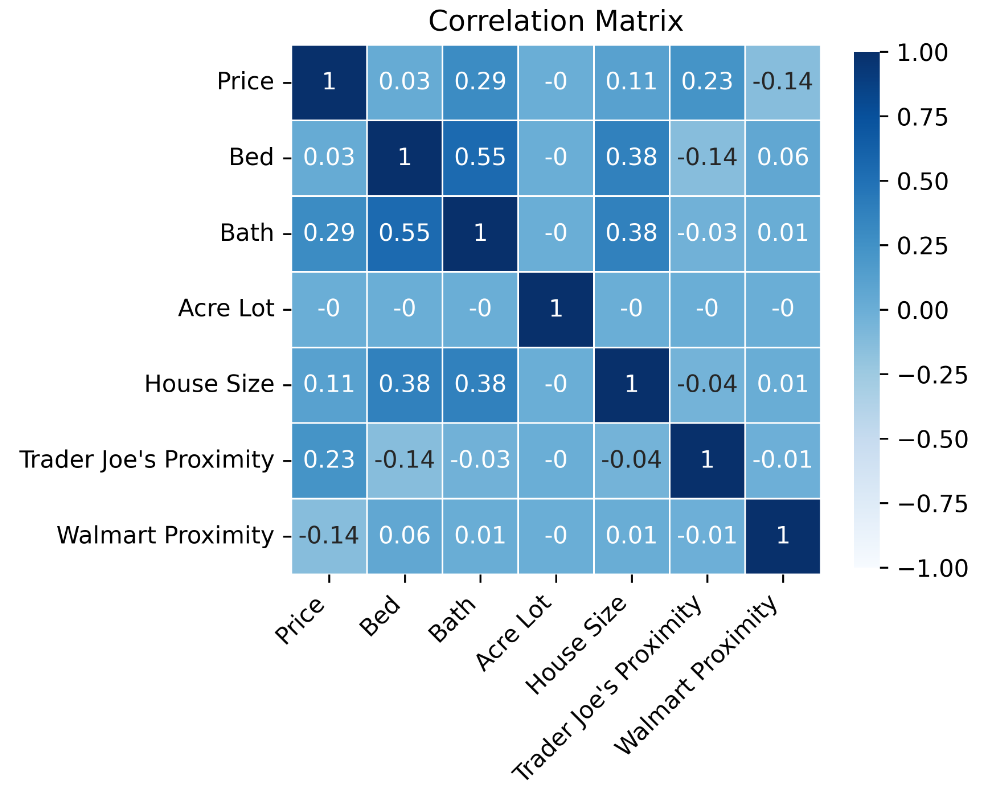
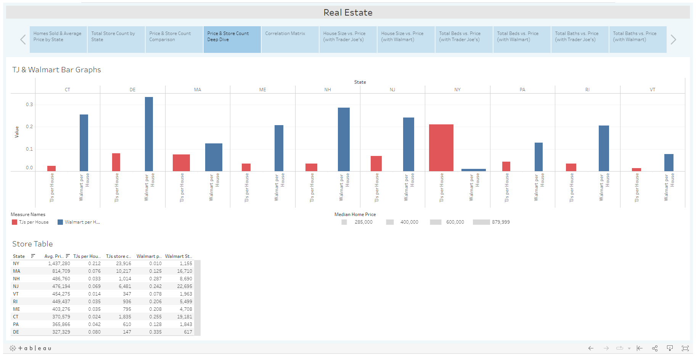
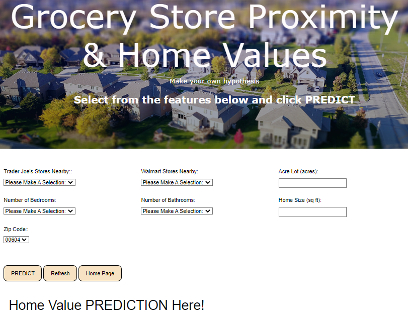

# Real_Estate

### Overview
The goal of this project is to determine if a connection exists between home values and the home proximity to a grocery store, specifically Trader Joe's and Walmart. Proximity to a grocery store, among other features (beds, baths, square footage), is then used to create a Flask App that will predict home prices.

**Essential Question:** What is the correlation between home value and proximity to Trader Joe’s or Walmart?

### Datasets
The real estate dataset that was used for this analysis (over 900,000 lines of data) and the subsequent clean dataset that was created after the ETL process were too large to push to GitHub. However, the initial datasets are available on Kaggle at the following links and running the code in Data_Cleaning folder will yield a clean dataset to use for the machine learning model. 
- [Real Estate Dataset](https://www.kaggle.com/datasets/ahmedshahriarsakib/usa-real-estate-dataset)
- [Trader Joe's Dataset](https://www.kaggle.com/datasets/saejinmahlauheinert/trader-joes-locations?select=tj-locations.csv)
- [Walmart Dataset](https://www.kaggle.com/code/timmofeyy/walmart-stores-location-eda/data)

### Technologies
- **Extract, Transform, Load:** Jupyter Notebook, Pandas, Numpby, Plotly, Matplotlib, Seaborn
- **Machine Learning:** Jupyter Notebook, Pandas, Sklearn
- **Data Visualization:** Tableau
- **Real Estate Value Aoo:** HTML, JavaScript, Flask, CSS

### Extract, Transform, Load
The following processes are present in the Data_Cleaning folder in order to have data that was usable for visualization, machine learning, and the app.
- Loading the real estate, Trader Joe's, and Walmart data
- Dropping redundant (i.e. retaining address and dropping street), unnecessary (i.e. status), and/or largely blank (i.e. sell data) columns
- Filling NaNs for acre lot with 0 because NaNs indicated apartments
- Filtering location of real estate to the New England region to create some controls for location
- Returning zip codes that started with 0 to five digit zip codes (i.e. returning 1001 to 01001)
- Adding a TJs_store_count and Walmart_store_count column and merging the number of stores in a given piece of real estate's zip code into those columns
- Investigating and removing specific outliers

After these processes our finished dataframe was exported to a CSV file. Below is a sample of the dataframe after the ETL process. 

### Data Visualization
All data visualization was completed using a Tableau Public data story and can be see by clicking [HERE](https://public.tableau.com/app/profile/amanda.palenchar/viz/RealEstateProject_16686111659970/RealEstate). Additionally, below are the most important visualizations.

The **Correlation Matrix** shows that no single feature has a high correlation with the price of real estate. However, baths and Trader Joe's proximity have the highest correlations with Walmart proximity coming in 3rd, albeit a negative correlation. 

The **Price & Store Count Deep Dive** shows the average Trader Joe's and Walmart's per piece of real estate with the bar widths representing the median cost of real estate in that state. New York is the only New England state to have far more Trader Joe's per house than Walmart and it also has far higher average price per house.

### Machine Learning
PyCaret supported the decision to use the Extra Trees Regressor model for machine learning. **This model produced an R² value of 0.911.** This model was then used in the web app to predict a housing value based on the features of the dataset. 

When choosing a model, speed and accuracy were at a premium. Using Extra Trees Regressor was best for the data because we intended to use the entire dataset (which is the default setting and can be changed). This allows Extra Trees regressor to reduce bias in the model. In terms of computational cost, Extra Trees is much faster than Random Forest. This is because Extra Trees randomly selects the value at which to split features.

# Real Estate Value App
Using the Extra Tree Regressor machine learning model, the web app predicts the price of a house after the user inputs a few features (beds, baths, home size, acre lot, Trader Joe's nearby, and Walmart's nearby) and chooses the predict button. 

